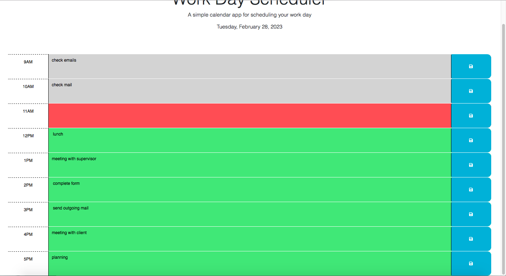

# Schedule Maker

## Description

This website is intended to help users manage their work-day schedule, from 9AM to 5PM. The user will be able to clearly see the current date, in the header. Every hour timeblock is color-coded to represent whether it is in the past (gray), present (red), or future (green) in order and it updates according to the time of day. When the user types in a task or event and clicks the save button, their input will be saved.  If the user refreshes the page, their input will still be there, unless they choose to delete it or write something else. 

## User Story

```md
AS AN employee with a busy schedule
I WANT to add important events to a daily planner
SO THAT I can manage my time effectively
```

## Acceptance Criteria

```md
GIVEN I am using a daily planner to create a schedule
WHEN I open the planner
THEN the current day is displayed at the top of the calendar
WHEN I scroll down
THEN I am presented with timeblocks for standard business hours
WHEN I view the timeblocks for that day
THEN each timeblock is color coded to indicate whether it is in the past, present, or future
WHEN I click into a timeblock
THEN I can enter an event
WHEN I click the save button for that timeblock
THEN the text for that event is saved in local storage
WHEN I refresh the page
THEN the saved events persist
```

## Screenshot of Website
The following animation demonstrates the application functionality:
<!--START_SECTION:update_image-->



<!--END_SECTION:update_image-->

## Link to Deployed Website

- - -
© 2022 Trilogy Education Services, LLC, a 2U, Inc. brand. Confidential and Proprietary. All Rights Reserved.
